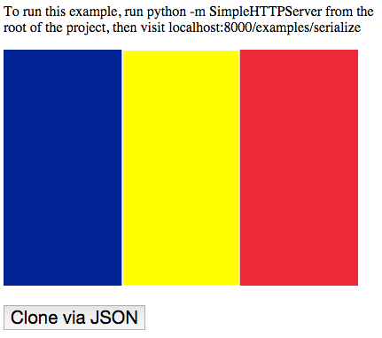

## regioned-image

Breaks an image into regions of contiguous pixels. You can set the colors
and boundaries of regioned images and render them to a canvas.

## Setup

Install the package.

```
npm install regioned-image --save
```

Require the module.

```javascript
var RegionedImage = require("regioned-image");
```

Note: RegionedImage needs to run a browser context. You can use something like
[browserify](http://browserify.org/) to bundle RegionedImage as a dependency.
Take a look at the example if you need help with this.

## Usage

```html
<canvas id="canvas"></canvas>

<script>
  var image = new RegionedImage("france.svg");
  image.onload = function () {

    // Print the dimensions of the image.
    console.log(image.width);  // 600
    console.log(image.height); // 400

    // Build the regions for the flag of france.
    image.buildRegion({ x: 100, y: 10 }); // Blue
    image.buildRegion({ x: 300, y: 10 }); // White
    image.buildRegion({ x: 500, y: 10 }); // Red

    // Get the blue region from the 'regions' property.
    var blueRegion = image.regions[0];

    // Print the number of pixels in the region.
    console.log(blueRegion.size); // 80000

    // Print the original color of the region.
    console.log(blueRegion.originalColor); // #0055A4

    // Print whether the region contains a cell.
    console.log(blueRegion.contains({ x: 90, y: 20 })); // true

    // Set the region's color to yellow.
    blueRegion.color = "#FFFF00";

    // Set the region's boundary color to green.
    blueRegion.boundaryColor = "#00FF00";

    // Get the red region by specifying a pixel inside the region.
    var redRegion = image.regionAt({ x: 490, y: 20 });

    // Merge the red region into the blue region.
    blueRegion.merge(redRegion);

    // Print the number of pixels in the blue and red regions.
    console.log(blueRegion.size); // 160000
    console.log(redRegion.size);  // 0

    // Print the number of regions in the regioned image.
    console.log(image.regions.length); // 2

    // Render the image to the canvas.
    var canvas = document.getElementById("canvas");
    image.render(canvas);
  };
</script>
```

You can specify a different width and height for the image at initialization:

```javascript
var image = new RegionedImage("france.svg", {
  width: 300,
  height: 200
});
```

The aspect ratio of the image will be preserved. This means that the image may
be smaller than the width and height specified.

## Serialization

Once the image has loaded, you can serialize your regioned image to json:

```javascript
var image = new RegionedImage("france.svg");
var json;

image.onload = function () {
  image.buildRegion({ x: 100, y: 10 });
  json = image.toJson();
};

var clone = RegionedImage.fromJson(json);
console.log(clone.regions.length); // 1
```

## Touch events

You can register a touch listener for the regioned image. It will be given the
relative coordinates of the touch:

```javascript
var image = new RegionedImage("france.svg");
var canvas = document.getElementById("canvas");

image.onload = function () {
  image.render(canvas);
};

image.ontouch = function (x, y) {
  var region = image.buildRegion({ x: x, y: y });
  region.color = "#FFFF00";
  image.render(canvas);
};
```

## Screenshot



## Contribution

Please send a pull request or open an issue.

You should follow me on [twitter](https://twitter.com/cpatuzzo).
